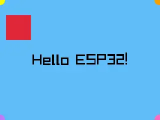

# ESP-IDF Component: Raylib

ESP-IDF wrapper component for [raylib](https://www.raylib.com/) - a simple and easy-to-use library to enjoy videogames programming.

This component enables running raylib on ESP32 microcontrollers using the **CPU-based software renderer** (no GPU required), making it possible to create graphics applications on embedded devices with LCD displays.

## Architecture: Port Layer

This implementation uses a **board-agnostic port layer** (`esp_raylib_port`) that separates display hardware management from the raylib rendering engine:

- **esp_raylib_port**: Stable API for display initialization and framebuffer operations
- **Inversion of control**: Application creates display handles and passes them to the port
- **Deterministic builds**: Board selection via Kconfig, no dynamic component injection
- **Multi-board support**: Switch boards by changing `SDKCONFIG_DEFAULTS`

## Try it Online

Test Raylib on ESP32 directly in your browser using Wokwi simulation (no hardware or build required):


[](https://wokwi.com/experimental/viewer?diagram=https%3A%2F%2Fraw.githubusercontent.com%2Fgeorgik%2Fesp-idf-component-raylib%2Fmain%2Fraylib%2Fexamples%2Fhello%2Fwokwi%2Fesp-box-3%2Fdiagram.json&firmware=https%3A%2F%2Fgithub.com%2Fgeorgik%2Fesp-idf-component-raylib%2Freleases%2Fdownload%2Fv6.0.0%2Fraylib-hello-v6.0.0-esp-box-3.bin)

[](https://wokwi.com/experimental/viewer?diagram=https%3A%2F%2Fraw.githubusercontent.com%2Fgeorgik%2Fesp-idf-component-raylib%2Fmain%2Fraylib%2Fexamples%2Fhello%2Fwokwi%2Fesp-box-3%2Fdiagram.json&firmware=https%3A%2F%2Fgithub.com%2Fgeorgik%2Fesp-idf-component-raylib%2Freleases%2Fdownload%2Fv6.0.0%2Fraylib-hello-v6.0.0-esp-box-3.bin)

**[Run ESP32-S3-BOX-3 (320x240)](https://wokwi.com/experimental/viewer?diagram=https%3A%2F%2Fraw.githubusercontent.com%2Fgeorgik%2Fesp-idf-component-raylib%2Fmain%2Fraylib%2Fexamples%2Fhello%2Fwokwi%2Fesp-box-3%2Fdiagram.json&firmware=https%3A%2F%2Fgithub.com%2Fgeorgik%2Fesp-idf-component-raylib%2Freleases%2Fdownload%2Fv6.0.0%2Fraylib-hello-v6.0.0-esp-box-3.bin)**


## Flash Pre-built Binaries

No build required! Flash pre-built binaries directly from your browser using ESP Launchpad:

[](https://georgik.github.io/esp-idf-component-raylib/?flashConfigURL=https://georgik.github.io/esp-idf-component-raylib/config/config.toml)

**Supported boards:**
- ESP32-S3-BOX-3
- M5Stack Core2

**Requirements:**
- Chrome or Edge browser (WebSerial support required)
- USB cable connected to your board

## For Developers of ESP-IDF Component

### Quick Start for Development

Clone the repository and build in-place (no publishing required):

```bash
# Clone the repository
git clone --recurse-submodules https://github.com/georgik/esp-idf-component-raylib.git
cd esp-idf-component-raylib

# Navigate to the example
cd raylib/examples/hello

# Set your target chip
idf.py set-target esp32s3

# Build the example (uses local components automatically)
idf.py build

# Flash to your board
idf.py -p /dev/ttyUSB0 flash monitor
```

**How it works:** The example's `idf_component.yml` uses `override_path` to reference the local `raylib` and `esp_raylib_port` components. Changes you make to the component source code are immediately reflected when you rebuild - no need to publish or create separate projects.

### Development Workflow

1. **Make changes** to component source code in `raylib/` or `esp_raylib_port/`
2. **Rebuild** the example: `cd raylib/examples/hello && idf.py build`
3. **Test** on hardware or in Wokwi simulator
4. **Iterate** - changes take effect immediately

### Board-Specific Testing

Test with different board configurations:

```bash
cd raylib/examples/hello

# ESP-BOX-3
cp sdkconfig.defaults.esp-box-3 sdkconfig.defaults
idf.py set-target esp32s3
idf.py build

# ESP32-P4 (Chip Revision 3.0+)
cp sdkconfig.defaults.esp32_p4_function_ev_board sdkconfig.defaults
idf.py set-target esp32p4
idf.py build

# ESP32-P4 (Chip Revision 1.0 - older boards)
cp sdkconfig.defaults.esp32_p4_function_ev_board_rev-1.0 sdkconfig.defaults
idf.py set-target esp32p4
idf.py build

# M5Stack Core2
cp sdkconfig.defaults.m5stack_core2 sdkconfig.defaults
idf.py set-target esp32
idf.py build
```

**Note - ESP32-P4 Chip Revisions:**
The ESP32-P4 Function EV Board is available with different chip revisions:
- **Rev 3.0+**: Use `sdkconfig.defaults.esp32_p4_function_ev_board` (200MHz Octal PSRAM)
- **Rev 1.0**: Use `sdkconfig.defaults.esp32_p4_function_ev_board_rev-1.0` (compatible with older silicon)

To check your chip revision:
```bash
esptool.py --port /dev/ttyUSB0 chip_id
```
Look for "Revision: X.Y" in the output.

### Clean Build

To ensure a clean build after making changes:

```bash
cd raylib/examples/hello
idf.py fullclean
idf.py build
```

### Verifying Component Dependencies

Check that components are resolved from local paths:

```bash
cd raylib/examples/hello
idf.py reconfigure 2>&1 | grep -i "component\|dependency"
```

Expected output should show paths like:
```
/Users/georgik/projects/esp-idf-component-raylib/esp_raylib_port
/Users/georgik/projects/esp-idf-component-raylib/raylib
```

### CI/CD Testing

For automated testing across multiple configurations, use `idf-build-apps`:

```bash
pip install idf-build-apps
idf-build-apps build raylib/examples
```

## For Maintainers

### Upgrading Raylib Submodule

This component uses the official raylib library as a Git submodule. To upgrade:

```bash
# Navigate to the raylib submodule
cd raylib/raylib

# Fetch latest changes
git fetch origin

# Check available updates
git log HEAD..origin/master --oneline

# Choose upgrade strategy:
# Option 1: Latest master (bleeding edge)
git checkout origin/master

# Option 2: Specific release tag (recommended)
git checkout 6.0

# Option 3: Specific commit
git checkout <commit-hash>

# Return to main repo and stage the update
cd ../..
git add raylib/raylib

# Update version in raylib/idf_component.yml
# (e.g., 5.6.0~0 -> 6.0.0~0)
```

**Post-Upgrade Checklist:**

1. **Update component wrapper code:**
   - [ ] Remove `utils.c` from `raylib/CMakeLists.txt` `SRCS` (removed in 6.0)
   - [ ] Update compile flag: `GRAPHICS_API_OPENGL_11_SOFTWARE` → `GRAPHICS_API_OPENGL_SOFTWARE`
   - [ ] Add `-Wno-unused-label` to compile options (software renderer has unused labels)
   - [ ] Add `SW_FRAMEBUFFER_COLOR_TYPE=R5G6B5` to compile definitions

2. **Update platform code:**
   - [ ] Fix include order in `raylib/src/platforms/rcore_esp_idf.c`: `config.h` must be before `rlgl.h`
   - [ ] Add render dimensions initialization in `raylib/raylib/src/rcore.c` (before `rlglInit()` call)
   - [ ] Restore `swGetColorBuffer()` in `raylib/raylib/src/external/rlsw.h` (function declaration + implementation)
   - [ ] Add vertical flip in `SwapScreenBuffer()` for LCD coordinate system

3. **Update config.h:**
   - [ ] Ensure `SW_FRAMEBUFFER_COLOR_TYPE R5G6B5` is defined
   - [ ] Ensure `SW_COLOR_BUFFER_BITS=16` is set
   - [ ] Check for conflicts with new raylib headers

4. **Test compilation:**
   ```bash
   cd raylib/examples/hello
   idf.py fullclean
   idf.py set-target esp32s3
   idf.py build
   ```

5. **Test on hardware:**
   ```bash
   idf.py -p /dev/ttyUSB0 flash monitor
   ```
   Verify:
   - [ ] Display shows correct colors (RGB565, not RGBA8888)
   - [ ] Image orientation is correct (not upside down)
   - [ ] Text is readable
   - [ ] Animation is smooth
   - [ ] No memory corruption

6. **Test multiple targets:**
   - [ ] ESP32-S3 (most common)
   - [ ] ESP32-P4 (if available)
   - [ ] ESP32 (baseline)

7. **Commit changes:**
   ```bash
   git add raylib/CMakeLists.txt raylib/include/config.h raylib/src/platforms/ raylib/raylib/src/rcore.c raylib/raylib/src/external/rlsw.h
   git commit -m "Upgrade raylib to 6.0.0"
   ```

**Common Issues and Fixes:**

- **Display shows wrong colors/purple tint**:
  - **Cause**: Software renderer using RGBA8888 instead of RGB565
  - **Fix**: Add `SW_FRAMEBUFFER_COLOR_TYPE=R5G6B5` to compile definitions AND ensure config.h is included before rlgl.h

- **Display shows nothing/green screen only**:
  - **Cause**: `swGetColorBuffer()` returning NULL or 0×0 dimensions
  - **Fix**: Initialize `CORE.Window.render.width/height` in `rcore.c` before `rlglInit()` call

- **Display is upside down**:
  - **Cause**: LCD coordinate system origin differs from software renderer
  - **Fix**: Add vertical flip in `SwapScreenBuffer()` when copying framebuffer

- **Build error: undefined reference to swGetColorBuffer**:
  - **Cause**: Function removed in Raylib 6.0
  - **Fix**: Restore function in rlsw.h (function declaration + implementation)

- **Build error: utils.c not found**:
  - **Cause**: File removed in Raylib 6.0
  - **Fix**: Remove from CMakeLists.txt SRCS list

### Migration: Raylib 5.6 to 6.0

Version 6.0 of raylib introduced several breaking changes that required specific updates to the ESP-IDF wrapper. This section documents the changes made to the wrapper component during the upgrade.

#### Wrapper-Specific Changes

The ESP-IDF wrapper required the following modifications to work with Raylib 6.0:

**1. Include Order Fix**

**Problem**: The software renderer's internal pixel format was defaulting to RGBA8888 instead of RGB565.

**Root Cause**: `config.h` (which defines `SW_FRAMEBUFFER_COLOR_TYPE`) was included **after** `rlgl.h`. Since `rlgl.h` includes the software renderer (`rlsw.h`), the `#ifndef SW_FRAMEBUFFER_COLOR_TYPE` check in `rlsw.h` evaluated to `true` before the wrapper's configuration could take effect.

**Fix**: Changed include order in `raylib/src/platforms/rcore_esp_idf.c`:
```c
// Before:
#include "raylib.h"
#include "rlgl.h"
#include "config.h"  // Too late!

// After:
#include "config.h"   // Must be first
#include "raylib.h"
#include "rlgl.h"
```

**2. Compile Definition for Pixel Format**

**Problem**: Even with correct include order, the pixel format was still RGBA8888.

**Root Cause**: Header-only macro definitions don't always propagate correctly through complex include chains.

**Fix**: Added `SW_FRAMEBUFFER_COLOR_TYPE=R5G6B5` directly to compile definitions in `raylib/CMakeLists.txt`:
```cmake
target_compile_definitions(${COMPONENT_TARGET} PUBLIC
    GRAPHICS_API_OPENGL_SOFTWARE
    PLATFORM_CUSTOM
    SW_COLOR_BUFFER_BITS=16
    SW_DEPTH_BUFFER_BITS=16
    SW_FRAMEBUFFER_COLOR_TYPE=R5G6B5  # Added this
)
```

**3. Restored swGetColorBuffer() Function**

**Problem**: Direct framebuffer access was removed in Raylib 6.0 PR #5655. The replacement `swReadPixels()` function was not working correctly for embedded use (it returns conversion data, not raw framebuffer).

**Solution**: Added `swGetColorBuffer()` back to `raylib/raylib/src/external/rlsw.h`:
```c
// Function declaration (after line 672)
SWAPI void *swGetColorBuffer(int *width, int *height);

// Function implementation (after swReadPixels)
void *swGetColorBuffer(int *width, int *height)
{
    if (width) *width = RLSW.colorBuffer->width;
    if (height) *height = RLSW.colorBuffer->height;
    return RLSW.colorBuffer->pixels;
}
```

**Why**: Direct framebuffer access is essential for embedded platforms to avoid expensive format conversions on every frame.

**4. Fixed Render Dimensions Initialization**

**Problem**: Software renderer was initialized with 0×0 dimensions, causing `swGetColorBuffer()` to return zero-sized buffer.

**Root Cause**: In `raylib/raylib/src/rcore.c`, `rlglInit()` is called with `CORE.Window.render.width/height` before these values are set (they're set later in `SetupViewport()`).

**Fix**: Added initialization code in `rcore.c` (lines 686-692) to set render dimensions before `rlglInit()`:
```c
// FIX: Initialize render dimensions for embedded platforms
// On desktop platforms, these are set by the window creation code.
// On embedded platforms with no window manager, we need to set them
// before rlglInit() is called.
if (CORE.Window.render.width == 0 || CORE.Window.render.height == 0)
{
    CORE.Window.render.width = CORE.Window.screen.width;
    CORE.Window.render.height = CORE.Window.screen.height;
}
```

**5. Added Vertical Flip for LCD Coordinate System**

**Problem**: Display was upside down compared to expected output.

**Root Cause**: LCD panels typically have coordinate origin (0,0) at bottom-left, while software renderer assumes top-left.

**Fix**: Modified `SwapScreenBuffer()` in `raylib/src/platforms/rcore_esp_idf.c` to flip framebuffer vertically:
```c
// Copy with vertical flip for LCD coordinate system
for (int row = 0; row < screen_height; row++) {
    int src_row = screen_height - 1 - row;  // Flip vertically
    memcpy(framebuffer + (row * screen_width),
           sw_framebuffer + (src_row * screen_width),
           screen_width * sizeof(uint16_t));
}
```

#### Raylib 6.0 Breaking Changes (Generic)

These are changes in the upstream raylib library that affected all platforms:

**1. utils.h Module Removed**

- **Change**: The `utils.h` header no longer exists
- **Impact**: `TRACELOG()` and related functions moved to `config.h`
- **Fix**: Update includes from `#include "utils.h"` to `#include "config.h"`

**2. Software Renderer Flag Renamed**

- **Change**: `GRAPHICS_API_OPENGL_11_SOFTWARE` → `GRAPHICS_API_OPENGL_SOFTWARE`
- **Impact**: Compile flag in `CMakeLists.txt` needed updating
- **Fix**: Updated in wrapper's `CMakeLists.txt`

**3. Removed Source Files**

- **Change**: `utils.c` removed from raylib 6.0
- **Impact**: Build failure if still in `SRCS` list
- **Fix**: Removed from `CMakeLists.txt` `SRCS`

**4. Software Renderer Warnings**

- **Change**: New unused labels in `rlsw.h`
- **Impact**: Compiler warnings about unused labels
- **Fix**: Added `-Wno-unused-label` to compile options

#### API Compatibility

Most raylib drawing APIs remain unchanged. Your application code should work without modifications if it uses standard raylib functions:
- `DrawCircle()`, `DrawRectangle()`, `DrawText()`
- `ClearBackground()`, `BeginDrawing()`, `EndDrawing()`
- Texture loading and rendering
- Input handling

**Performance improvements in 6.0**:
- Software renderer optimizations
- Better framebuffer management for embedded targets
- Improved low-level rendering APIs

#### Testing Checklist

After upgrading, verify on actual hardware:

- [ ] Display shows correct colors (not inverted or wrong format)
- [ ] Image is oriented correctly (not upside down)
- [ ] Text rendering is readable
- [ ] Memory usage is within PSRAM limits
- [ ] Performance is acceptable (frame rate)
- [ ] All drawing primitives work (shapes, text, textures)
- [ ] No memory leaks or corruption over time

#### Important Points for Embedded Development

1. **Pixel format configuration must happen at compile time**, not through headers alone
2. **Direct framebuffer access is critical** for embedded performance - avoid conversion functions
3. **Coordinate system differences** between software renderer and LCD panels require manual flipping
4. **Render dimensions must be initialized before `rlglInit()`** on embedded platforms
5. **Always test on actual hardware** - simulators may not catch pixel format issues

For more details on upstream changes, see the official raylib changelog: https://github.com/raysan5/raylib/blob/master/CHANGELOG

## Build from Source (For Users)

Users installing this component from the component registry can build examples with:

```bash
cd raylib/examples/hello

# Method 1: Explicit SDKCONFIG_DEFAULTS
idf.py set-target esp32s3
idf.py -DSDKCONFIG_DEFAULTS="sdkconfig.defaults;sdkconfig.defaults.esp-box-3" reconfigure build flash monitor

# Method 2: Using ESPBrew (recommended for multi-board development)
espbrew --cli-only .
```

## Repository Structure

```
esp-idf-component-raylib/
├── README.md                  # This file
├── esp_raylib_port/           # Port layer component (georgik/esp_raylib_port)
│   ├── idf_component.yml      # Published separately
│   └── src/                   # Board-agnostic display API
└── raylib/                    # Main component (georgik/raylib)
    ├── README.md              # Component documentation
    ├── CMakeLists.txt         # Component build configuration
    ├── idf_component.yml      # Component metadata
    ├── include/               # Wrapper headers
    ├── src/                   # ESP-IDF platform backend
    ├── raylib/                # Submodule: official raylib (master)
    └── examples/
        └── hello/             # Demo application
            └── README.md      # Example documentation
```

## Documentation

- **[Component Documentation](raylib/README.md)** - Architecture, configuration, and API
- **[Hello Example](raylib/examples/hello/README.md)** - Complete working example with build instructions

## Features

- **Software Rendering** - No OpenGL/GPU required, runs entirely on CPU
- **RGB565 Framebuffer** - Optimized for ESP LCD panels
- **PSRAM Support** - Allocates framebuffers in external PSRAM
- **ESP-BSP Integration** - Works with esp-bsp noglib components
- **2D Graphics** - Shapes, textures, text rendering, sprites

## Supported Hardware

**Fully tested and working:**
- **ESP32-S3-BOX-3** (320x240 ILI9341, SPI)
- **ESP32-P4 Function EV Board** (1024x600, MIPI-DSI) - Rev 1.0 and 3.0+
- **M5Stack Core S3** (320x240, SPI)
- **M5Stack Core2** (320x240 ILI9342C, SPI, PMU-powered)

**Easy to add:** Any board with ESP-BSP noglib support or custom esp_lcd panel.

## Requirements

- **ESP-IDF 5.5+** (tested with 6.0)
- **ESP32-S3** or **ESP32-P4** (PSRAM recommended)
- **Board Support Package (BSP)** noglib version for your board

## What Can You Build?

With raylib on ESP32, you can create:
- 2D games and animations
- Interactive dashboards and HMIs
- Data visualization
- Educational demos
- Retro-style graphics applications

## Learning Resources

- [raylib official website](https://www.raylib.com/)
- [raylib cheatsheet](https://www.raylib.com/cheatsheet/cheatsheet.html)
- [raylib examples](https://www.raylib.com/examples.html)

## Current Limitations

- Audio module not yet implemented
- 3D models disabled (requires filesystem)
- Touch input framework ready but not yet connected
- Large displays (1024x600) render slowly at full resolution

See [Component README](raylib/README.md) for detailed information.

## Contributing

Contributions welcome.

## License

This wrapper component: **zlib/libpng** (matching raylib license)

## Credits

- [raylib](https://www.raylib.com/) by Ramon Santamaria ([@raysan5](https://github.com/raysan5))
- Software renderer (rlsw) by Le Juez Victor ([@Bigfoot71](https://github.com/Bigfoot71))
- Software renderer merged via [raylib PR #4832](https://github.com/raysan5/raylib/pull/4832)
- ESP-IDF platform integration by this component

## Documentation

- **[Component Documentation](raylib/README.md)** - Architecture, configuration, and API
- **[Hello Example](raylib/examples/hello/README.md)** - Complete working example
- **[Implementation Guide](PLAN_A_IMPLEMENTATION.md)** - Detailed user guide and API reference
