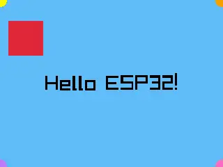

# ESP-IDF Component: Raylib

ESP-IDF wrapper component for [raylib](https://www.raylib.com/) - a simple and easy-to-use library to enjoy videogames programming.

This component enables running raylib on ESP32 microcontrollers using the **CPU-based software renderer** (no GPU required), making it possible to create graphics applications on embedded devices with LCD displays.

**[Component Registry](https://components.espressif.com/components/georgik/raylib)** - Available via ESP Component Manager (`idf.py add-component`)

**[Examples](https://components.espressif.com/components/georgik/raylib/versions/6.0.0~2/examples)** - Ready-to-use examples from Component Registry

## Architecture

This implementation uses a **direct callback approach** where board-specific examples handle display initialization and register callbacks with raylib:

```
Application (main.c)
    ↓
Display Init (BSP or direct esp_lcd)
    ↓
rcore Callbacks (raylib_esp_set_display_callbacks)
    ↓
raylib (rcore_esp_idf.c platform backend)
    ↓
esp_lcd (ESP-IDF display driver)
```

- **Board-specific examples**: Each board has a dedicated example in `raylib/examples/`
- **Template-based generation**: Examples are generated from a single template using the standalone example-maker tool
- **BSP integration**: Works with esp-bsp noglib components for supported boards
- **Direct display init**: For boards without BSP, custom display initialization is provided

## Try It Online

Test Raylib on ESP32 directly in your browser using Wokwi simulation (no hardware or build required):

[](https://wokwi.com/experimental/viewer?diagram=https%3A%2F%2Fraw.githubusercontent.com%2Fgeorgik%2Fesp-idf-component-raylib%2Fmain%2Fraylib%2Fexamples%2Fesp32s3%2Fespressif-esp32-s3-box-3_hello%2Fdiagram.json&firmware=https%3A%2F%2Fgithub.com%2Fgeorgik%2Fesp-idf-component-raylib%2Freleases%2Fdownload%2Fv6.0.0%2Fraylib-hello-v6.0.0-esp-box-3.bin)

[](https://wokwi.com/experimental/viewer?diagram=https%3A%2F%2Fraw.githubusercontent.com%2Fgeorgik%2Fesp-idf-component-raylib%2Fmain%2Fraylib%2Fexamples%2Fesp32s3%2Fespressif-esp32-s3-box-3_hello%2Fdiagram.json&firmware=https%3A%2F%2Fgithub.com%2Fgeorgik%2Fesp-idf-component-raylib%2Freleases%2Fdownload%2Fv6.0.0%2Fraylib-hello-v6.0.0-esp-box-3.bin)

**Run ESP32-S3-BOX-3 (320x240)**

**[Screenshot Gallery](https://georgik.github.io/esp-idf-component-raylib/gallery/)** - View simulation results from automated testing

## Flash Pre-built Binaries

Flash pre-built binaries directly from your browser using ESP Launchpad:

[](https://georgik.github.io/esp-idf-component-raylib/?flashConfigURL=https://georgik.github.io/esp-idf-component-raylib/config/config.toml)

**Supported boards for Online flasher:**
- ESP32-S3-BOX-3
- M5Stack Core2

**Requirements:**
- Chrome or Edge browser (WebSerial support required)
- USB cable connected to your board

## For Users

### Quick Start

Clone the repository and build an example:

```bash
# Clone the repository
git clone --recurse-submodules https://github.com/georgik/esp-idf-component-raylib.git
cd esp-idf-component-raylib

# Navigate to an example (e.g., ESP32-S3-BOX-3)
cd raylib/examples/esp32s3/espressif-esp32-s3-box-3_hello

# Set your target chip
idf.py set-target esp32s3

# Build the example
idf.py build

# Flash to your board
idf.py -p /dev/ttyUSB0 flash monitor
```

### Available Examples

Board-specific examples are organized by chip:

**ESP32-S3 boards:**
```
raylib/examples/esp32s3/
├── espressif-esp32-s3-box-3_hello/        # 320x240 ILI9341
├── espressif-esp32-s3-box_hello/          # 320x240 ST7789
├── espressif-esp32-s3-eye_hello/          # 240x240 ST7789
├── espressif-esp32-s3-korvo-2_hello/      # 320x240 ILI9341
├── espressif-esp32-s3-lcd-ev-board_hello/ # 480x480 GC9503
├── espressif-esp-vocat_hello/             # 360x360 ST77916
├── m5stack-atom-s3_hello/                 # 128x128 GC9A01
├── m5stack-atom-s3r_hello/                # 128x128 ST7735 (driver change 2026-05-14)
└── m5stack-core-s3_hello/                 # 320x240 ILI9341
```

**ESP32 boards:**
```
raylib/examples/esp32/
└── m5stack-core2_hello/                  # 320x240 ILI9342
```

### How It Works

Each example uses `override_path` in `idf_component.yml` to reference the local raylib component. Changes to the component source are reflected immediately when rebuilding.

## For Developers

### Development Workflow

1. **Make changes** to component source in `raylib/src/` or `raylib/include/`
2. **Rebuild** an example: `cd raylib/examples/<board>_hello && idf.py build`
3. **Test** on hardware or in Wokwi simulator
4. **Iterate** - changes take effect immediately

### Clean Build

To ensure a clean build after making changes:

```bash
cd raylib/examples/<board>_hello
idf.py fullclean
idf.py build
```

### Verifying Component Dependencies

Check that components are resolved from local paths:

```bash
cd raylib/examples/<board>_hello
idf.py reconfigure 2>&1 | grep -i "component\|dependency"
```

Expected output should show paths to the local raylib component.

## For Maintainers

### Template System & Example Generation

All board examples are generated from a single template by **example-maker**, a standalone code-generation tool written in Rust (https://github.com/georgik/example-maker). This keeps every example structurally identical and makes adding new boards straightforward.

- **Tool:** https://github.com/georgik/example-maker
- **Template location:** `raylib/templates/raylib-hello-c/`
- **Generated examples:** `raylib/examples/<vendor-board>_hello/`

### Installing example-maker

The tool is bundled in this repository under `example-maker/`. Build and install it with Cargo:

```bash
cd example-maker
cargo install --path .        # installs ~/.cargo/bin/example-maker

# or build only / run without installing:
cargo build --release
cargo run --release -- regenerate
```

You can also clone the standalone project instead of using the bundled copy:

```bash
git clone https://github.com/georgik/example-maker
cd example-maker && cargo install --path .
```

### Regenerating examples

`example-maker` is invoked **from the directory that holds `templates/`** (here, `raylib/`). The template resolves relative to that location by default; pass `--template <dir>` for anything else.

```bash
cd raylib
example-maker regenerate          # expands all boards -> raylib/examples/

# from a different template / into a different place:
example-maker regenerate --template ../other/template --output ../out
```

It prints per-board results and ends with a summary line, e.g. `Summary: 10 successful, 0 failed`. If `templates/` is not found in the current directory it exits with an error telling you to pass `--template <dir>` or run from the templates directory.

> **Maintainers only.** Regeneration should be done by maintainers so users get ready-made examples without installing anything. Keep `raylib/examples/` committed; the bundled engine contains fixes that are not yet upstreamed.

### Adding a New Board

To add support for a new board:

1. **Edit the template:**
   - Add board option to `raylib/templates/raylib-hello-c/template.yaml`
   - Add BSP dependency to `raylib/templates/raylib-hello-c/main/idf_component.yml`
   - Add board-specific code to `raylib/templates/raylib-hello-c/main/main.c`:
     - TAG definition
     - Display dimensions
     - InitWindow call
     - Display init (BSP or direct)

2. **Regenerate examples:**
    ```bash
    cd raylib
    example-maker regenerate
    ```

3. **Test the new example:**
   ```bash
   cd raylib/examples/<new_board>_hello
   idf.py set-target <chip>
   idf.py build flash monitor
   ```

### Template Structure

```
raylib/templates/raylib-hello-c/
├── template.yaml              # Board options and metadata
├── main/
│   ├── idf_component.yml      # Component dependencies (conditional)
│   ├── main.c                 # Main code with conditional compilation
│   └── README.md
└── CMakeLists.txt
```

**Conditional compilation syntax:**
```c
//IF option("board_name")
    // Board-specific code
//ELIF option("other_board")
    // Other board code
//ELSE
    // Default code
//ENDIF
```

### Upgrading Raylib Submodule

This component uses the official raylib library as a Git submodule. To upgrade:

```bash
cd raylib/raylib
git fetch origin
git checkout 6.0  # or specific tag/commit
cd ../..
git add raylib/raylib
```

See the migration notes in this repository for detailed upgrade instructions.

## Repository Structure

```
esp-idf-component-raylib/
├── README.md                  # This file
├── example-maker/             # Standalone code generator (https://github.com/georgik/example-maker)
├── raylib/                    # Main component
│   ├── README.md              # Component documentation
│   ├── CMakeLists.txt         # Component build configuration
│   ├── idf_component.yml      # Component metadata
│   ├── include/               # Wrapper headers
│   ├── src/                   # ESP-IDF platform backend
│   ├── raylib/                # Submodule: official raylib
│   ├── templates/             # Example templates
│   │   └── raylib-hello-c/    # Hello example template
│   └── examples/              # Generated board examples
│       ├── esp32/             # ESP32 chip examples
│       │   └── m5stack-core2_hello/
│       └── esp32s3/           # ESP32-S3 chip examples
│           ├── espressif-esp32-s3-box-3_hello/
│           ├── m5stack-core-s3_hello/
│           └── ...
```

## Continuous Integration

The project uses automated testing via Wokwi simulation:

- **All examples** are built and tested on each commit
- **Screenshots** are captured for supported boards (ESP32-S3-BOX-3, M5Stack Core S3)
- **[Screenshot Gallery](https://georgik.github.io/esp-idf-component-raylib/gallery/)** - View simulation results from CI

See **[CI Documentation](docs/CI.md)** for detailed information about testing infrastructure, current limitations, and board-specific status.

## Documentation

- **[CI Documentation](docs/CI.md)** - Continuous integration, testing status, and limitations
- **[Component README](raylib/README.md)** - Architecture, configuration, and API
- **[Template Guide](raylib/templates/raylib-hello-c/README.md)** - Template structure reference

## Features

- Software Rendering - No OpenGL/GPU required
- RGB565 Framebuffer - Optimized for ESP LCD panels
- PSRAM Support - Allocates framebuffers in external PSRAM
- ESP-BSP Integration - Works with esp-bsp noglib components
- Template-Based Examples - Consistent code structure across boards
- 2D Graphics - Shapes, textures, text rendering, sprites

## Requirements

- **ESP-IDF 5.5+** (tested with 6.0)
- **ESP32-S3**, **ESP32**, or **ESP32-P4** (PSRAM recommended)
- Board Support Package (BSP) noglib version for supported boards

## What Can You Build

With raylib on ESP32, you can create:
- 2D games and animations
- Interactive dashboards and HMIs
- Data visualization
- Educational demos
- Retro-style graphics applications

## Learning Resources

- [raylib official website](https://www.raylib.com/)
- [raylib cheatsheet](https://www.raylib.com/cheatsheet/cheatsheet.html)
- [raylib examples](https://www.raylib.com/examples.html)

## Current Limitations

- Audio module not yet implemented
- 3D models disabled (requires filesystem)
- Touch input framework ready but not yet connected
- Large displays (1024x600) render slowly at full resolution

For CI testing limitations and board-specific status, see the [CI Documentation](docs/CI.md).

## Hardware Notes

- **M5Stack Atom S3R**: Display driver changed from GC9107 to ST7735 (2026-05-14). ST7735 driver not available in ESP-IDF, implementation uses ST7789 driver (similar Sitronix chip family).

## License

This wrapper component: **zlib/libpng** (matching raylib license)

## Credits

- [raylib](https://www.raylib.com/) by Ramon Santamaria (@raysan5)
- Software renderer (rlsw) by Le Juez Victor (@Bigfoot71)
- ESP-IDF platform integration by this component
