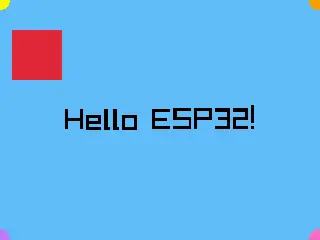

# ESP-IDF Component: Raylib

ESP-IDF wrapper component for [raylib](https://www.raylib.com/) - a simple and easy-to-use library to enjoy videogames programming.

This component enables running raylib on ESP32 microcontrollers using the **CPU-based software renderer** (no GPU required), making it possible to create graphics applications on embedded devices with LCD displays.

## 🏗️ Architecture: Port Layer

This implementation uses a **board-agnostic port layer** (`esp_raylib_port`) that separates display hardware management from the raylib rendering engine:

- **esp_raylib_port**: Stable API for display initialization and framebuffer operations
- **Inversion of control**: Application creates display handles and passes them to the port
- **Deterministic builds**: Board selection via Kconfig, no dynamic component injection
- **Multi-board support**: Switch boards by changing `SDKCONFIG_DEFAULTS`

## 🎮 Try it Online

Test Raylib on ESP32 directly in your browser using Wokwi simulation (no hardware or build required):


[](https://wokwi.com/experimental/viewer?diagram=https%3A%2F%2Fraw.githubusercontent.com%2Fgeorgik%2Fesp-idf-component-raylib%2Fmain%2Fraylib%2Fexamples%2Fhello%2Fwokwi%2Fesp-box-3%2Fdiagram.json&firmware=https%3A%2F%2Fgithub.com%2Fgeorgik%2Fesp-idf-component-raylib%2Freleases%2Fdownload%2Fv5.6.0%2Fraylib-hello-v5.6.0-esp-box-3.bin)

[](https://wokwi.com/experimental/viewer?diagram=https%3A%2F%2Fraw.githubusercontent.com%2Fgeorgik%2Fesp-idf-component-raylib%2Fmain%2Fraylib%2Fexamples%2Fhello%2Fwokwi%2Fesp-box-3%2Fdiagram.json&firmware=https%3A%2F%2Fgithub.com%2Fgeorgik%2Fesp-idf-component-raylib%2Freleases%2Fdownload%2Fv5.6.0%2Fraylib-hello-v5.6.0-esp-box-3.bin)

**[▶️ Run ESP32-S3-BOX-3 (320x240)](https://wokwi.com/experimental/viewer?diagram=https%3A%2F%2Fraw.githubusercontent.com%2Fgeorgik%2Fesp-idf-component-raylib%2Fmain%2Fraylib%2Fexamples%2Fhello%2Fwokwi%2Fesp-box-3%2Fdiagram.json&firmware=https%3A%2F%2Fgithub.com%2Fgeorgik%2Fesp-idf-component-raylib%2Freleases%2Fdownload%2Fv5.6.0%2Fraylib-hello-v5.6.0-esp-box-3.bin)**


## 🔌 Flash Pre-built Binaries

No build required! Flash pre-built binaries directly from your browser using ESP Launchpad:

[](https://georgik.github.io/esp-idf-component-raylib/?flashConfigURL=https://georgik.github.io/esp-idf-component-raylib/config/config.toml)

**Supported boards:**
- ESP32-S3-BOX-3

**Requirements:**
- Chrome or Edge browser (WebSerial support required)
- USB cable connected to your board

## 🚀 Build from Source

```bash
cd raylib/examples/hello

# Method 1: Explicit SDKCONFIG_DEFAULTS
idf.py set-target esp32s3
idf.py -DSDKCONFIG_DEFAULTS="sdkconfig.defaults;sdkconfig.defaults.esp-box-3" reconfigure build flash monitor

# Method 2: Using ESPBrew (recommended for multi-board development)
espbrew --cli-only .
```

## 📦 Repository Structure

```
esp-idf-component-raylib/
├── README.md                  # This file
├── esp_raylib_port/           # Port layer component (georgik/esp_raylib_port)
│   ├── idf_component.yml      # Published separately
│   └── src/                   # Board-agnostic display API
└── raylib/                    # Main component (georgik/raylib)
    ├── README.md              # Component documentation
    ├── CMakeLists.txt         # Component build configuration
    ├── idf_component.yml      # Component metadata
    ├── include/               # Wrapper headers
    ├── src/                   # ESP-IDF platform backend
    ├── raylib/                # Submodule: official raylib (master)
    └── examples/
        └── hello/             # Demo application
            └── README.md      # Example documentation
```

## 📚 Documentation

- **[Component Documentation](raylib/README.md)** - Architecture, configuration, and API
- **[Hello Example](raylib/examples/hello/README.md)** - Complete working example with build instructions

## ✨ Features

- ✅ **Software Rendering** - No OpenGL/GPU required, runs entirely on CPU
- ✅ **RGB565 Framebuffer** - Optimized for ESP LCD panels
- ✅ **PSRAM Support** - Allocates framebuffers in external PSRAM
- ✅ **ESP-BSP Integration** - Works with esp-bsp noglib components
- ✅ **2D Graphics** - Shapes, textures, text rendering, sprites

## 🎯 Supported Hardware

**Fully tested and working:**
- **ESP32-S3-BOX-3** (320x240 ILI9341, SPI)
- **ESP32-P4 Function EV Board** (1024x600, MIPI-DSI)
- **M5Stack Core S3** (320x240, SPI)

**Easy to add:** Any board with ESP-BSP noglib support or custom esp_lcd panel.

## 🛠️ Requirements

- **ESP-IDF 5.5+** (tested with 6.0)
- **ESP32-S3** or **ESP32-P4** (PSRAM recommended)
- **Board Support Package (BSP)** noglib version for your board

## 🎮 What Can You Build?

With raylib on ESP32, you can create:
- 2D games and animations
- Interactive dashboards and HMIs
- Data visualization
- Educational demos
- Retro-style graphics applications

## 📖 Learning Resources

- [raylib official website](https://www.raylib.com/)
- [raylib cheatsheet](https://www.raylib.com/cheatsheet/cheatsheet.html)
- [raylib examples](https://www.raylib.com/examples.html)

## ⚠️ Current Limitations

- Audio module not yet implemented
- 3D models disabled (requires filesystem)
- Touch input framework ready but not yet connected
- Large displays (1024x600) render slowly at full resolution

See [Component README](raylib/README.md) for detailed information.

## 🤝 Contributing

Contributions welcome! Areas of interest:
- Additional board support
- Performance optimizations
- Input handling implementation
- Color format fixes
- Audio backend

## 📄 License

This wrapper component: **zlib/libpng** (matching raylib license)

## 🙏 Credits

- [raylib](https://www.raylib.com/) by Ramon Santamaria ([@raysan5](https://github.com/raysan5))
- Software renderer (rlsw) by Le Juez Victor ([@Bigfoot71](https://github.com/Bigfoot71))
- Software renderer merged via [raylib PR #4832](https://github.com/raysan5/raylib/pull/4832)
- ESP-IDF platform integration by this component

## 📋 Documentation

- **[Component Documentation](raylib/README.md)** - Architecture, configuration, and API
- **[Hello Example](raylib/examples/hello/README.md)** - Complete working example
- **[Implementation Guide](PLAN_A_IMPLEMENTATION.md)** - Detailed user guide and API reference
